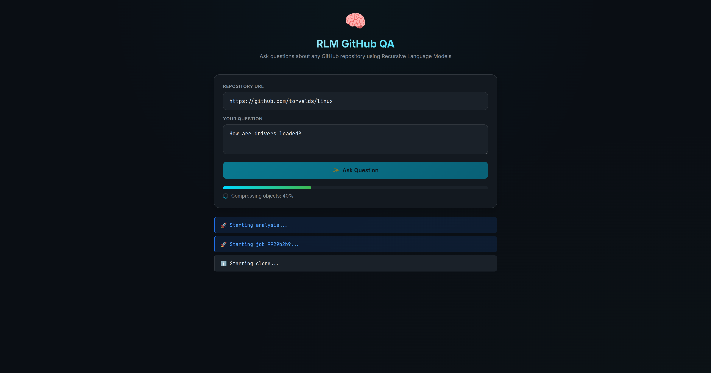

# RLM GitHub QA

Recursive Language Model (RLM) implementation for analyzing GitHub repositories with a web UI.

Based on the paper "Recursive Language Models" (https://arxiv.org/abs/2512.24601)

## What is an RLM?

RLMs allow LLMs to process arbitrarily long contexts (10M+ tokens) by:
1. Loading the entire context as a variable in a Python REPL
2. The LLM writes code to examine/decompose the context
3. Can recursively call sub-LMs on chunks of the context

This implementation uses the official `rlm` package from alexzhang13/rlm.

## Demo



## Setup

```bash
# Create virtual environment
python3 -m venv venv
source venv/bin/activate
pip install -r requirements.txt

# Copy .env.example to .env and add your API key
cp .env.example .env
```

You need a nano-gpt.com API key (or any OpenAI-compatible API).

## Usage

### Web UI (Recommended)

```bash
python web_ui.py
```

Then open http://localhost:3136 in your browser.

Features:
- Clone any GitHub repository
- Ask questions about the codebase
- Live progress bar for clone/file reading
- Real-time heartbeat during RLM processing
- Source citations with character positions

### Python API

```python
from github_qa import ask_about_repo, create_rlm

# Ask about a GitHub repo
answer = ask_about_repo(
    "https://github.com/torvalds/linux",
    "How are drivers loaded in this codebase?"
)

# Or use custom settings
rlm = create_rlm(max_iterations=10, max_depth=3)
answer = ask_about_repo(
    "https://github.com/torvalds/linux",
    "What programming languages are used?",
    rlm=rlm,
    max_context_size_mb=10
)
```

## Configuration

- `NANO_GPT_API_KEY` - Your API key
- `NANO_GPT_BASE_URL` - API endpoint (default: https://nano-gpt.com/api/v1)

## Architecture

- `github_qa.py` - Core RLM logic, repo cloning, file reading
- `web_ui.py` - Flask web server with SSE streaming
- Uses minimax/minimax-m2.5-official model for both root and sub-LLMs
- `logs/` - Execution traces for debugging

## How It Works

1. **Clone** - Git clones the repo (with progress tracking)
2. **Read** - Files are read and concatenated into context (up to 10MB)
3. **Analyze** - RLM processes the context, can recursively call sub-LLMs on chunks
4. **Answer** - Returns answer with source citations like `context[1000:2000]`

The web UI supports multiple concurrent users with per-job queues and real-time SSE streaming.
